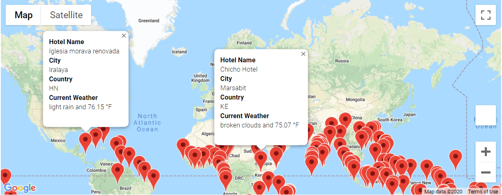
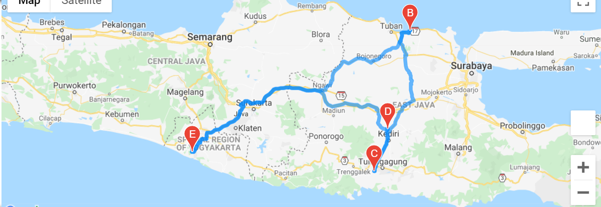
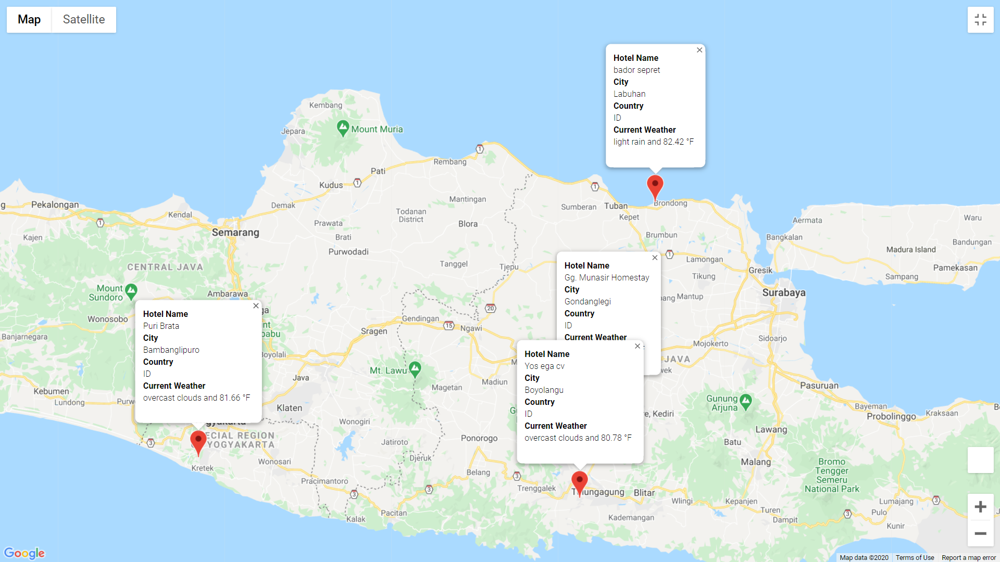

# World Weather Analysis

## Overview

 Retrieve Weather Data 
  *  Generate a set of 2,000 random latitudes and longitudes, retrieve the nearest city, and perform an API call with the OpenWeatherMap. Use your API to retrieve the current weather description for each city. Then, create a new DataFrame containing the updated weather data.

 Create a Customer Travel Destinations Map
 * Use input statements to retrieve customer weather preferences, then use those preferences to identify potential travel destinations and nearby hotels. Then, show those destinations on a marker layer map with pop-up markers.

 Create a Travel Itinerary Map
 * Use the Google Directions API to create a travel itinerary that shows the route between four cities chosen from the customer’s possible travel destinations. Then, create a marker layer map with a pop-up marker for each city on the itinerary.

 ## Resources
Jupyter Notebook,  Anaconda 4.8.3,  Google API, OpenWeatherMap API
 ## Results
 * Dataframe of random cities and weather conditions can be found here:

 [Weather Database](Weather_Database/WeatherPy_Database.csv)

* Cities that matched the input statements are listed here:

 [Vacation Database](Vacation_Search/WeatherPy_vacation.csv)

 and displayed:

* Map of directions created with google api:

* Map with pop-ups fo reach city.

